# Linkedin - SSL certificates for web developers

[linkedin course](https://www.linkedin.com/learning/ssl-certificates-for-web-developers)

# SSL
secure socket layer

# TLS
transport layer security, is the new one

# HTTPS
secure hypertext protocol

- data privacy
- data integrity
- encrypts the information

# Certificate
- they don't depend about TLS os SSL
- they just check the public an private key match

# Why Certificate?
- we need to encrypt the information
- we need to check the identity

# Certificate names
- SSL certificate
- SSL/TLS certificate
- Digital certificate
- public key certificate

# Certificate content
- organization
- url
- country
- validate date range
- issuer (validator)

# Certificate file types
- .crt
- .cer

# Symetric key cryptography
same key for encrypt and decrypt
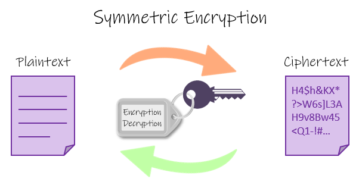  

# Public key cryptography
one key for encrypt and other key for decrypt
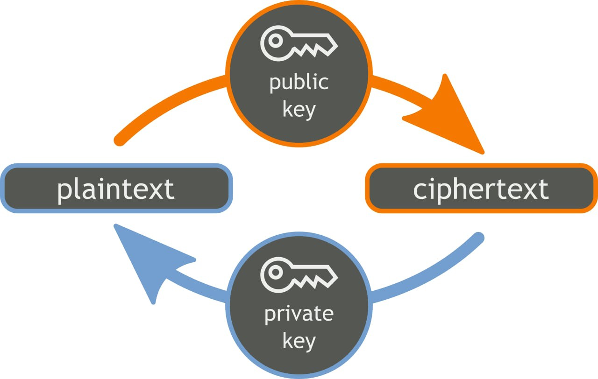  


# SSL/TLS handshake
1. client ask for a certificate
2. client check the certificate
    - issuer
    - expiration
3. client encrypt password
4. server decrypt password
5. the simetric communication starts using that password
it combines the privacy of asymetric with the speed of symetric
- it just use the password during a session

# HTTP history
1994 for eshops
since then, for all sites, is the default now.


# Let's Encrypt
- 2016
- free certificates

# Chrome mark http as not secure
- 2017 when they have password or credit card fields
- 2017 submission form as not secure
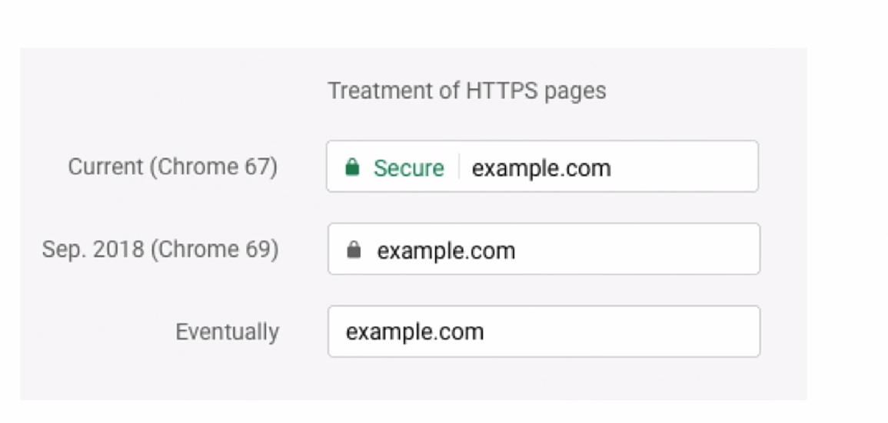  
- the idea is be secure by default, and show an alert in case of a security issue

# Certificate authorities (CAs)
- certify ownership of a public key

# Who to get a certificate from a CA
1. give some information
2. place the public key in your server
3. request a certificate
4. wait for validation

# Certificate authorities types
- Root CA
- Intermediate CA

you could connect to any
- they ask for some feed

# Paid certificate authorities
- Comodo
- indenTrust
- DigiCert
- GoDaddy
- GlobalSign
- Entrust
- Symantec
- Verisign
- GeoTrust
- Thawte
- RapidSSL

# Free certificate authorities
[text](https://letsencrypt.org/es/)
let's encrypt: promote the use of https in the web
- valid for 90 days

# Certificate types
all of them let you encrypt

## Paid certificates
## Free certificates
## Self signed certificates
- useful for system who trust each other (not browser)
- useful for local applications
- not approved by a certificate authority
- no third-party trust
    - security alert in browser

# Domain scopes
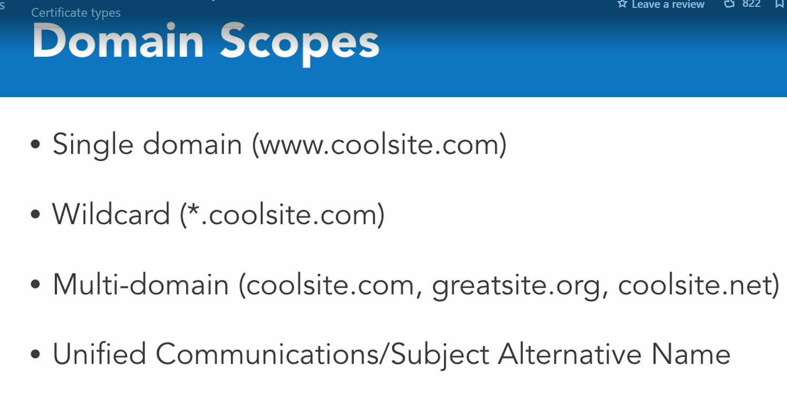  
- just change the cost
- the multi-domain allows you to create mydomain.*

# Domain validation levels
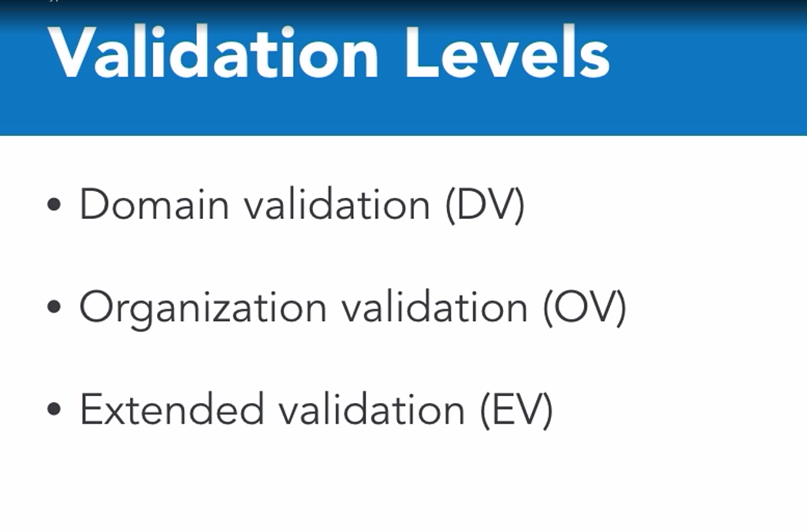  
level 1 - check file in the website
level 2 - check on internet who you are
level 3 - make a phone call


# Cerbot
- Client for let's encrypt
    - it uses python and ACME protocol

# traditional ssl installation
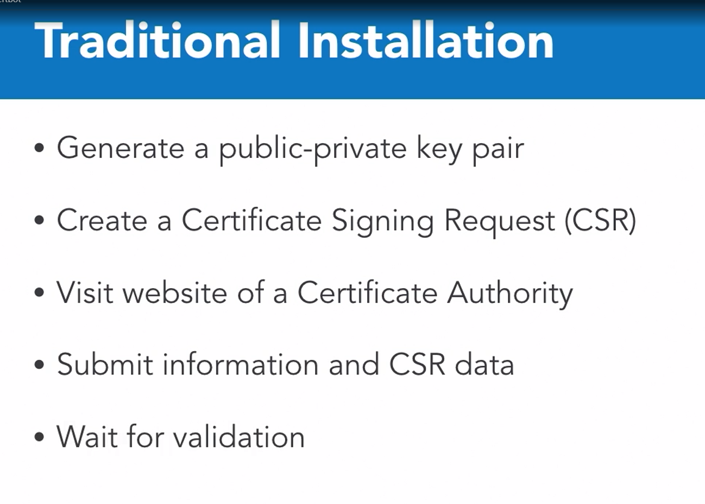  

1. generate public-private key part
2. generate CSR
3. send, pay and wait for certificate
4. install on web server

# Certificate generation using Certbot installation
1. install cerbot and run

Script for ubuntu
```shell
sudo snap install core; sudo snap refresh core
sudo snap install --classic certbot
sudo ln -s /snap/bin/certbot /usr/bin/certbot
sudo certbot --nginx
# make sure your port 80 and 443 is available
# make sure the nginx installation is clean
```
- after the installation it creates several nginx configuration files for you
- and generate the keys

# Certificate generation manual - for pay websites
# openssl generation
⚠ don't do this using online generators, you will compromise the key

1. generate key-private
- 512 is the minimum allowed value
- 2048 is the minimum recommended value
```shell
openssl genrsa -out domain.key 2048 
```
2. generate csr
```shell
openssl req -new -key domain.key -out domain.csr
```

# FQDN - Fully Qualified Domain Name
3. choose your certificate, push the csr and wait for the certificate
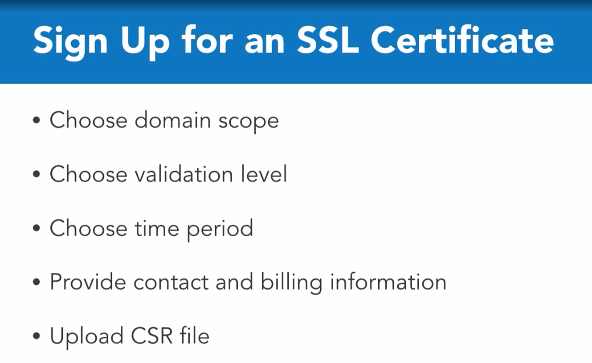  

4. configure the chain crt and crt file on the server
    - the chain is needed for intermediate CAs

# Apache certiciate
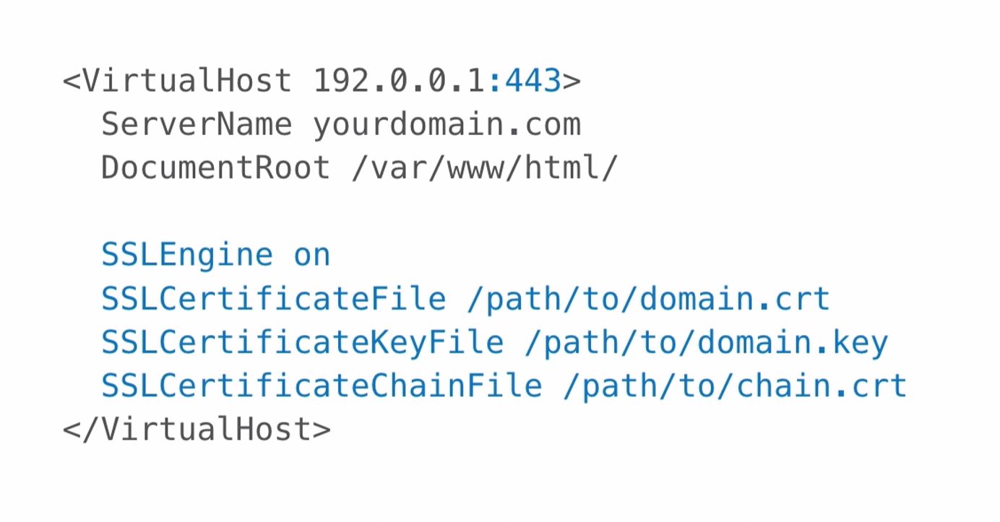  

# Redirect http to HTTPS
# Apache redirect
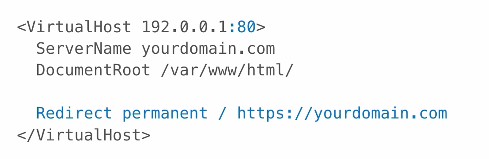  

# NGINX redirect
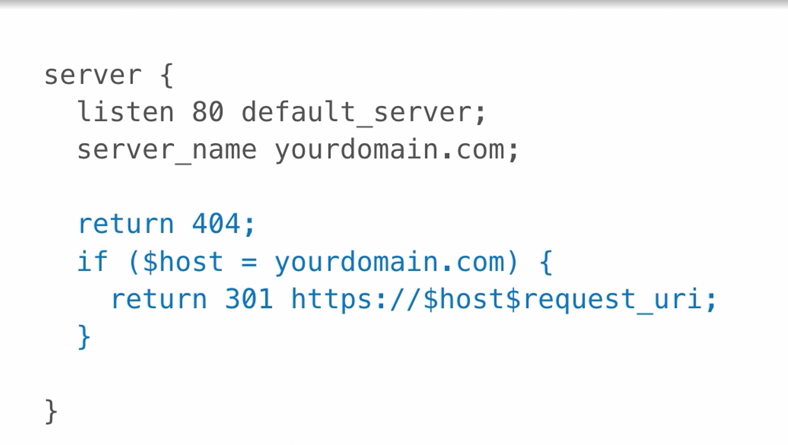  

# http code 301
permanent redirect

# Http Strict Transport Security (HSTS)
- browser remember https connection, and redirect to them 
- don't ever try an insecure request

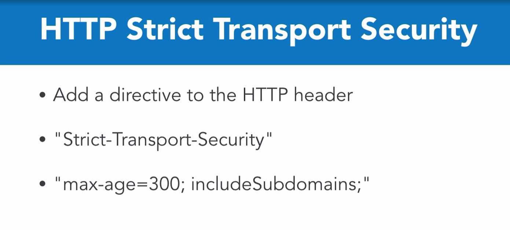  

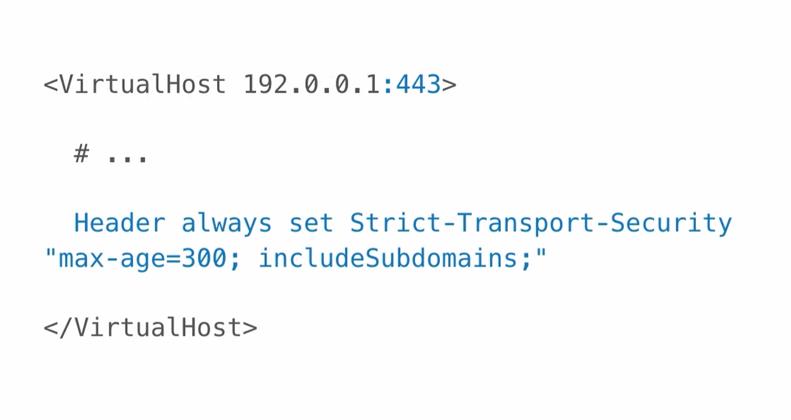  
  
# HSTS preloading
[web to check preload](https://hstspreload.org/)

# Expiration dates, why?
- new security standard
- compromise to renew the trust
- compromise to re-validates
